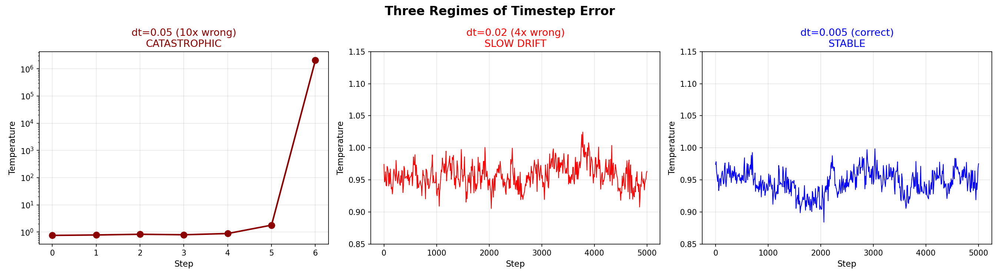
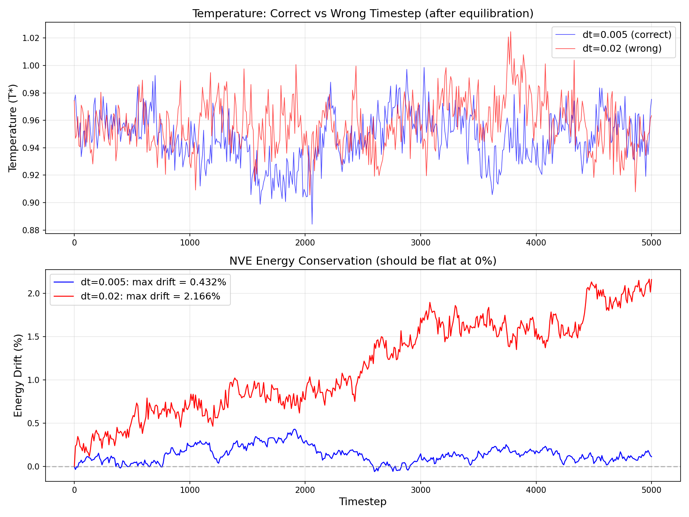
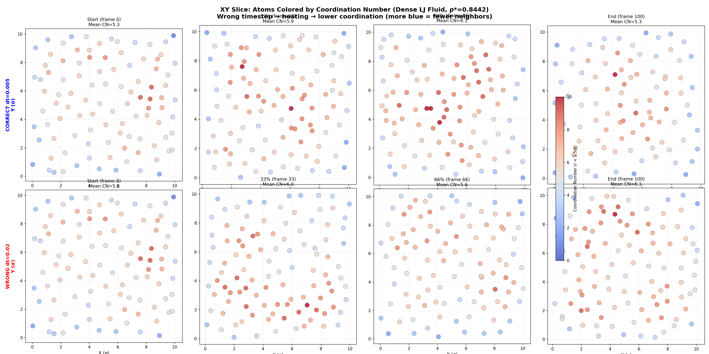
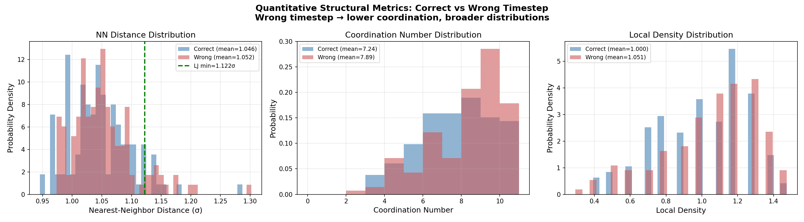
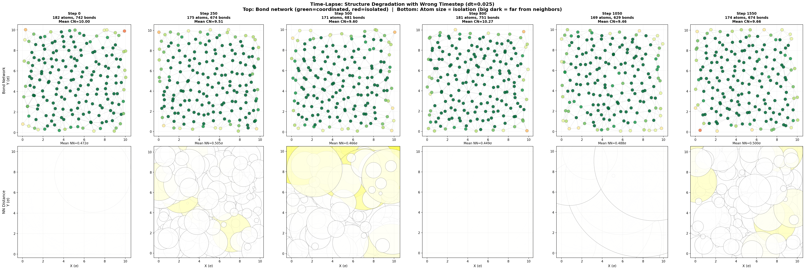
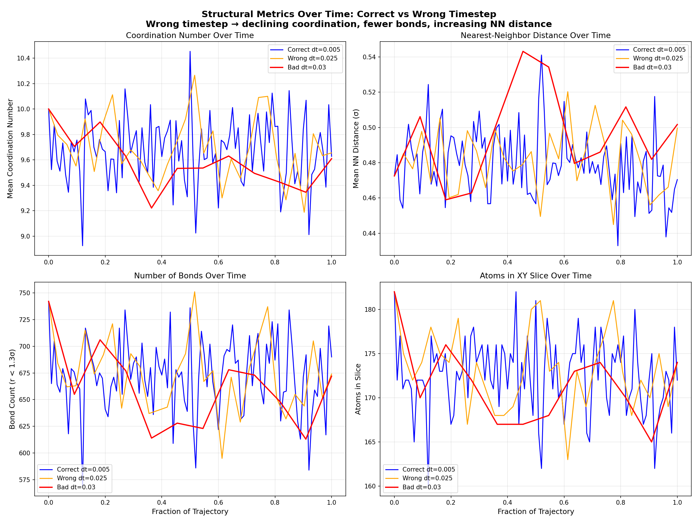
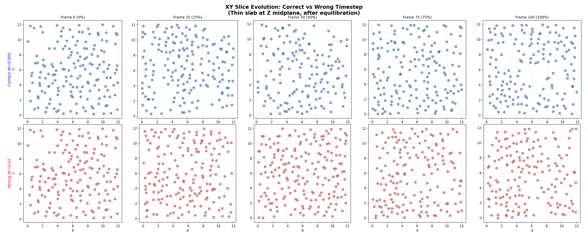
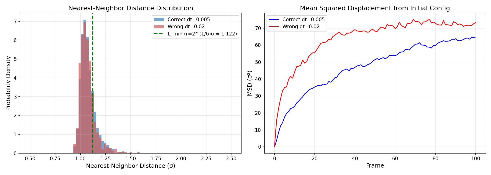

# LAMMPS Molecular Dynamics: Visualization Case Studies

Visualization cases for LAMMPS molecular dynamics simulations, designed as pedagogical demonstrations of common simulation pitfalls and their diagnostic signatures. Each case provides input scripts, simulation logs, analysis code, and publication-ready figures.

---

## Case 1: Timestep-Induced Integration Failure in Lennard-Jones Fluids

### Motivation

The velocity Verlet integrator conserves a shadow Hamiltonian that differs from the true Hamiltonian by O(dt^2). When dt exceeds a critical threshold, the shadow Hamiltonian ceases to exist and the integrator diverges catastrophically (Engle, Skeel & Drees, 2005). This case study systematically demonstrates how excessive timesteps destroy energy conservation, corrupt structural properties, and ultimately crash the simulation -- progressing from subtle drift to violent explosion.

### System Setup

All simulations use the standard Lennard-Jones pair potential (epsilon = 1.0, sigma = 1.0, cutoff = 2.5sigma) in reduced units, with 864 atoms on an FCC lattice under periodic boundary conditions.

| Parameter | Low-Density Series | Dense-Liquid Series |
|---|---|---|
| Reduced density rho* | 0.50 | 0.8442 |
| Temperature T* | 0.75 | 0.75 |
| Atoms | 864 (6x6x6 FCC) | 864 (6x6x6 FCC) |
| Equilibration | NVT, 5000 steps at dt* = 0.005 | NVT, 5000 steps at dt* = 0.005 |
| Production ensemble | NVE | NVE |

The dense-liquid state point (rho* = 0.8442, T* = 0.75) follows the benchmark established by Nicolas, Gubbins, Streett & Tildesley (1979) and extensively validated by Johnson, Zollweg & Gubbins (1993).

### Experimental Design

Timestep is varied from the recommended dt* = 0.005 (Frenkel & Smit, 2002; Allen & Tildesley, 2017) up to 10x the correct value. All runs share identical initial conditions (velocity seed 12345) and equilibration protocols, isolating the timestep as the sole variable.

| Input Script | Density | Production dt* | Factor | Steps | Outcome |
|---|---|---|---|---|---|
| `in.correct_v2` | 0.50 | 0.005 | 1x | 5000 | Stable |
| `in.explosion_mild` | 0.50 | 0.01 | 2x | 2000 | Mild drift |
| `in.wrong_v2` | 0.50 | 0.02 | 4x | 5000 | Monotonic energy drift (+2.2%) |
| `in.explosion` | 0.50 | 0.05 | 10x | 6 | Catastrophic explosion |
| `in.dense_correct` | 0.8442 | 0.005 | 1x | 10000 | Stable |
| `in.dense_wrong` | 0.8442 | 0.02 | 4x | 10000 | Energy drift (+0.084) |
| `in.dense_moderate_wrong` | 0.8442 | 0.025 | 5x | ~1550 | Crash (lost 822/864 atoms) |
| `in.dense_bad_v3` | 0.8442 | 0.03 | 6x | ~115 | Crash (lost 111/864 atoms) |
| `in.dense_very_wrong` | 0.8442 | 0.035 | 7x | 0 | Instant crash (lost 834/864 in 1 step) |

### Results

#### Three Regimes of Failure

The temperature evolution reveals three distinct failure regimes under NVE integration:

<p align="center">

</p>

**Left:** At dt* = 0.05 (10x), temperature explodes from ~1 to >2x10^6 within 6 steps (log scale). **Center:** At dt* = 0.02 (4x), temperature fluctuates normally but drifts upward over thousands of steps. **Right:** At dt* = 0.005 (correct), temperature remains statistically stationary around the equilibrium value.

#### Energy Conservation Breakdown

Direct comparison of NVE energy drift after proper equilibration:

<p align="center">

</p>

The correct timestep (blue) shows max energy drift of 0.43%, consistent with floating-point accumulation. The 4x-excessive timestep (red) exhibits monotonic upward drift reaching 2.17%, indicating systematic energy injection by integration error.

#### Structural Degradation in Dense Liquids

At the benchmark liquid density (rho* = 0.8442), wrong timesteps corrupt local structure even before the simulation crashes.

**Coordination number evolution** -- atoms colored by number of neighbors within 1.5sigma:

<p align="center">

</p>

Top row (dt* = 0.005): coordination remains uniform (~7-10 neighbors) throughout the trajectory. Bottom row (dt* = 0.02): coordination drops and becomes heterogeneous, with isolated atoms (blue/red) appearing by the final frame.

**Quantitative structural metrics** comparing correct vs. wrong timestep distributions:

<p align="center">

</p>

The wrong timestep shifts the nearest-neighbor peak away from the LJ potential minimum at r = 2^(1/6)sigma (green dashed line), broadens the coordination number distribution, and reduces mean local density -- all signatures of a fluid being artificially heated toward a gas-like state.

#### Progressive Structural Collapse

Time-lapse visualization of bond network degradation at dt* = 0.025 (5x), which crashes at step ~1550:

<p align="center">

</p>

Top row: bond network (lines connect pairs within 1.3sigma) and coordination coloring. Bottom row: atoms sized by nearest-neighbor distance (large circles = isolated atoms). The connected liquid structure progressively disintegrates as integration errors accumulate.

**Structural metrics over time** for three regimes (correct, 5x wrong, 6x wrong):

<p align="center">

</p>

Mean coordination number declines, nearest-neighbor distance increases, and bond count drops monotonically for both wrong timesteps (orange, red), while the correct timestep (blue) fluctuates stably around equilibrium values.

#### Spatial Analysis: XY Slice Evolution

Thin-slab snapshots at the Z-midplane reveal how atomic arrangement evolves:

<p align="center">

</p>

Top (dt* = 0.005): atoms maintain uniform spatial distribution across all frames. Bottom (dt* = 0.02): clustering and void formation develop progressively, indicating breakdown of the homogeneous liquid state.

**Nearest-neighbor distance distribution and mean squared displacement:**

<p align="center">

</p>

Left: the NN distance histogram for the wrong timestep shows a broader, right-shifted distribution. Right: MSD for dt* = 0.02 (red) is approximately 2x that of the correct timestep, indicating artificially enhanced diffusion from integration errors.

### Failure Mechanism

The cascade proceeds as follows:

1. **Integration error** -- Large dt causes the Verlet integrator to overshoot potential energy barriers, creating spurious overlaps.
2. **Energy injection** -- Overlapping atoms experience enormous repulsive forces, converting integration error into kinetic energy.
3. **Heating** -- Temperature and pressure rise monotonically as the system absorbs artificial energy.
4. **Lost atoms** -- At sufficient kinetic energy, atoms move farther than the neighbor list skin distance in a single step. LAMMPS terminates with `ERROR: Lost atoms`.

The critical timestep depends on density: the dilute system (rho* = 0.5) tolerates dt* = 0.02 without crashing, while the dense liquid (rho* = 0.8442) crashes at dt* = 0.025. Higher density means steeper force gradients and tighter stability requirements.

### File Inventory

```
case1_timestep_explosion/
  Input scripts:
    in.correct_timestep        # dt=0.005, no equilibration (baseline)
    in.correct_v2              # dt=0.005, NVT equilibrated then NVE
    in.explosion_mild          # dt=0.01, no equilibration (2x)
    in.wrong_v2                # dt=0.02, equilibrated then NVE (4x)
    in.explosion               # dt=0.05, no equilibration (10x, 2048 atoms)
    in.dense_correct           # dt=0.005, rho*=0.8442, equilibrated
    in.dense_wrong             # dt=0.02, rho*=0.8442 (4x)
    in.dense_moderate_wrong    # dt=0.025, rho*=0.8442 (5x)
    in.dense_bad_v3            # dt=0.03, rho*=0.8442 (6x)
    in.dense_very_wrong        # dt=0.035, rho*=0.8442 (7x)

  Analysis scripts:
    plot_comparison.py         # Correct vs mild comparison, explosion panel
    plot_v2.py                 # Three-regime comparison (equilibrated runs)
    plot_xy_slices.py          # Spatial analysis: XY slices, NN distance, MSD
    plot_dense_slices.py       # Dense liquid: coordination, histograms, bonds
    plot_dramatic.py           # Time-lapse degradation, structural metrics

  Log files:       log_*.out  # Thermodynamic output for each run
  Trajectories:    trajectory_*.xyz  # Atomic coordinates in XYZ format
  Figures:         *.png      # All generated visualizations
```

### How to Reproduce

```bash
# Run a simulation (requires LAMMPS)
lmp -in case1_timestep_explosion/in.dense_correct

# Generate figures (requires Python with numpy and matplotlib)
cd case1_timestep_explosion
python plot_v2.py
python plot_dense_slices.py
python plot_dramatic.py
python plot_xy_slices.py
python plot_comparison.py
```

---

## References

### Foundational LJ Benchmark References

| Paper | Key Result |
|---|---|
| Verlet (1967) *Phys. Rev.* **159**, 98. DOI: 10.1103/PhysRev.159.98 | Original LJ fluid MD. g(r) first peak at r ~ 1.08sigma, height ~2.7-3.0. Introduced the Verlet integrator. |
| Nicolas, Gubbins, Streett & Tildesley (1979) *Mol. Phys.* **37**, 1429. DOI: 10.1080/00268977900101051 | Origin of the rho* = 0.8442 benchmark state point. Comprehensive LJ equation of state. |
| Johnson, Zollweg & Gubbins (1993) *Mol. Phys.* **78**, 591. DOI: 10.1080/00268979300100411 | Definitive LJ thermodynamic properties. At rho* = 0.8442, T* ~ 0.75: U*/N ~ -6.1, P* ~ -0.3 to +0.5. |
| Kolafa & Nezbeda (1994) *Fluid Phase Equil.* **100**, 1 | High-accuracy LJ equation of state for validation. |

### Timestep Selection & Energy Conservation

| Paper | Key Result |
|---|---|
| Swope, Andersen, Berens & Wilson (1982) *J. Chem. Phys.* **76**, 637. DOI: 10.1063/1.442716 | Introduced the velocity Verlet algorithm. |
| Engle, Skeel & Drees (2005) *J. Comput. Phys.* **206**, 432. DOI: 10.1016/j.jcp.2004.12.009 | Velocity Verlet conserves a shadow Hamiltonian differing by O(dt^2). When dt is too large, the shadow Hamiltonian ceases to exist and integration diverges. |
| Plimpton (1995) *J. Comput. Phys.* **117**, 1. DOI: 10.1006/jcph.1995.1039 | Original LAMMPS paper. Documents "lost atoms" error when atoms move beyond the neighbor skin in one step. |

### Textbooks

| Book | Key Guidance |
|---|---|
| Frenkel & Smit, *Understanding Molecular Simulation* (2002) | Recommends dt* = 0.001-0.005 for LJ fluids. Energy conservation ~10^-4 per particle per 1000 steps. |
| Allen & Tildesley, *Computer Simulation of Liquids* (1987/2017). DOI: 10.1093/oso/9780198803195.001.0001 | dt* = 0.004-0.005 for good conservation. Energy drift scales as dt^2 for Verlet integrators. |
| Schlick, *Molecular Modeling and Simulation* (2010) | Max stable timestep: dt < 2/omega_max, roughly dt* ~ 0.01-0.02 for LJ. Practical accuracy needs dt* ~ 0.002-0.005. |
